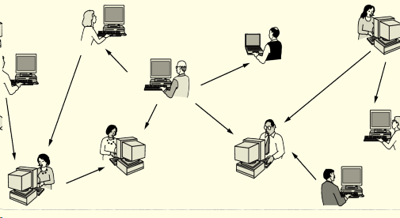

#### Nuestro Glosario: 

* **Red de computadoras**: es un conjunto interconectado de computadoras autónomas

* **Topología de red**: Es la forma en que se organizan los componentes de una red. Por lo tanto, es la forma, la apariencia de la red.

* **Internet**: Conjunto de redes interconectadas, descentralizadas y con alcance mundial.

* **Protocolos** (en el ámbito IT): Es un conjunto de reglas y especificaciones que rígen las comunicaciones.

* **Modélo TCP/IP**: Conjunto o suite de protocolos de red que permite la comunicación de datos entre dispositivos de redes informáticas. Creado en la decada del 70 y estandarizado en 1983 por la IETF.

* **Dirección MAC**: es un identificador de 48 bits (6 bloques de dos caracteres hexadecimales 8 bits) que corresponde de forma única a una tarjeta o dispositivo de red. Se la conoce también como dirección física, y es única para cada dispositivo.

* **Dirección IP**: Una dirección IP es un número de 32 bits. Identifica de forma única un host (equipo u otro dispositivo, como una impresora o enrutador) en una red TCP/IP. Las direcciones IP normalmente se expresan en formato decimal punteado, con cuatro números separados por puntos, como 192.168.123.132.
____

#### RED DE COMPUTADORAS

> Una red de computadoras, red de ordenadores o red informática es un conjunto de equipos nodos y software conectados entre sí por medio de dispositivos físicos que envían y reciben impulsos eléctricos, ondas electromagnéticas o cualquier otro medio para el transporte de datos, con la finalidad de compartir información, recursos y ofrecer servicios.

> Para poder formar una red se requieren elementos: **hardware, software y protocolos**.

> Los elementos físicos (hardware) se clasifican en dos grandes grupos:

>  * dispositivos de usuario final (hosts) : computadoras, servidores, impresoras, y demás elementos que esten conectada a una red a con un número de IP definidos. Su función es proporcionarle recursos, información y servicios directamente a los usuarios.
>  * dispositivos de red: son todos aquellos que conectan entre sí a los dispositivos de usuario final, posibilitando su intercomunicación.

## Entre los dispositivos de red se destacan:  

**Hub ( Concentrador )**: Es un dispositivo de red que se utiliza para conecta varios dispositivos (computadortas) entre sí. Es un dispositivo pasivo, lo que significa que no realiza ninguna manipulación de los datos recibe, solo transmite los paquetes a todos los puertos que contenga, esto es, si contiene 8 puertos, todas las computadoras que estén conectadas a dichos puertos recibirán la misma información. Por lo tanto, los hubs actúa sólo en el nivel físico o capa 1 del modelo OSI. **OBSOLETOS**
 
**Switch (Conmutador)**: es el dispositivo digital lógico de interconexión de equipos que opera en la capa de enlace de datos del modelo OSI (capa 2). Su función es interconectar dos o más host e intercambiar los datos transmitidos entre ellos de acuerdo a la dirección MAC de destino de las tramas o paquetes, mejorando el rendimiento y la seguridad de las redes de área local (LAN).

**Router**: también conocido como enrutador o encaminador — es un dispositivo que proporciona conectividad a nivel de red o nivel tres en el modelo OSI. Su función principal consiste en enviar o encaminar datos de una red a otra de acuerdo a la dirección IP destino del los paquetes IP, es decir, **interconecta subredes**.

____

###### Protocolos Relacionados: 

**DHCP** (Dynamic Host Configuration Protocol): es un protocolo cliente-servidor que proporciona automáticamente a los host de una red su dirección IP y otra información de configuración relacionados como por ejemplo, la puerta de enlace predeterminada y la máscara de subred. RFC 2131 y 2132 definen DHCP como un estándar de Internet Engineering Task Force (IETF)

**ICMP** (Internte Message Control Protocol): es un protocolo de control de la capa de red que utilizan los dispositivos de red para diagnosticar problemas de comunicación en la red. El ICMP se utiliza principalmente para determinar si los datos llegan o no a su destino a su debido tiempo (ping).

**ARP** (Address Resolution Protocol): protocolo de resolución de direcciones, para encontrar la dirección física (MAC) correspondiente a una determinada IP.

_____

### Hub - Switch - Router 
https://www.youtube.com/watch?v=Gky8-OVYmT4

___
Comandos: 

> >arp -a

> >ping 

> >tracert
 
> >netstat -n

> >netstat -r

____

##### MODELO CLIENTE SERVIDOR 
El modelo cliente-servidor es un estilo arquitectónico para aplicaciones distribuidas. 
Evolucionó en paralelo a las propias redes En este modelo existe una clara separación de las tareas:
  * Los clientes solicitan servicios
  * Los servidores atienden estas solicitudes red

    

##### MODELO P2P 
El modelo par-a-par se diferencia del modelo anterior en que no distingue entre clientes y servidores
* En cierta forma, todos los nodos de la red son tanto clientes como servidores
* Fue propuesto para atacar un problema inherente al modelo anterior: su compleja escalabilidad

  

##### ¿Qué servicios brinda la red?
Los usuarios necesitan poder usar sus programas de aplicación
A su vez, los programas de aplicación necesitan poder enviar y recibir información por la red

La red provee esencialmente dos servicios que para ese objetivo:

Establecer una comunicación orientada a la conexión (TCP)
  * Asegura la transmisión confiable y ordenada de un flujo de bytes
  * Implementa control de flujo y gestión de congestión

Establecer una comunicación sin conexión (UDP)
  * No asegura la transmisión confiable
  * No implementa control de flujo ni gestión de la congestión

**Ejemplos prácticos**

_Comunicación orientada a la conexión:_
 *   El protocolo HTTP de la web
 *   Los protocolos SMTP, POP e IMAP para acceder al correo electrónico

_Comunicación no orientada a la conexión:_
 *  El protocolo DNS para acceder a los servidores de dominio
 *  Los protocolos para transportar audio y/o video en tiempo real (por caso, SIP, RTP)
   
___
#### OTROS VIDEOS

#### ARP 
https://www.youtube.com/watch?v=UFa9O0GfnsY

#### DHCP           
https://www.youtube.com/watch?v=K07wzpcKrsk

#### DNS 
https://www.youtube.com/watch?v=gAstDaSaaWU

#### IP publicas y privadas
https://youtu.be/9oO_F7U4T4M

#### IANA
https://www.youtube.com/watch?v=IvVv-BaIiLk

