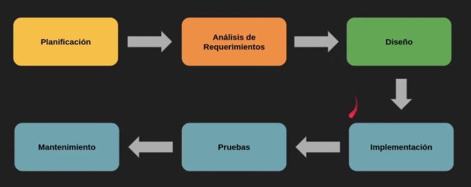
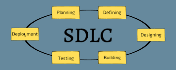

## El Ciclo de Vida del Desarrollo de Software (SDLC - Software Development Life Cycle)

**Objetivo Principal:** Conocer cuál es el ciclo de vida del desarrollo de software (SDLC).

**Repaso y conexión:**

* Recordar que las empresas de software tienen una estructura organizada para crear sus productos.
	- ¿Creen que se empieza a programar directamente una aplicación? 
	- ¿Qué pasos creen que hay antes y después de escribir el código?"

### **Desglosando el SDLC (Teoría):**

* **Explicación:** El SDLC como una serie de etapas planificadas que se siguen para construir un software de manera organizada y eficiente.

* **Etapas principales:**
    
	* **Planificación (Planning):** Definir los objetivos, alcance, recursos y cronograma del proyecto. (Ejemplo: Decidir qué funcionalidades básicas tendrá la aplicación de organización de tareas).
    * **Análisis de Requisitos (Requirements Analysis):** Entender detalladamente qué debe hacer el software. Recopilar las necesidades de los usuarios. (Ejemplo: Entrevistar a empleados para saber qué características les gustaría tener en la aplicación, relevar los horarios, los recursos y las tareas habituales).
    * **Diseño (Design):** Planificar cómo se verá y cómo funcionará el software. (Ejemplo: Crear bocetos de las pantallas de la aplicación y cómo navegar entre ellas).
    * **Implementación (Implementation / Coding):** Escribir el código del software. (Ejemplo: Los programadores escriben el código para que la aplicación funcione).
    * **Pruebas (Testing):** Verificar que el software funcione correctamente y cumpla con los requisitos. (Ejemplo: Probar que se puedan añadir tareas, marcar como completadas, recibir recordatorios, etc.).
    * **Despliegue (Deployment / Release):** Poner el software a disposición de los usuarios. (Ejemplo: Publicar la aplicación en las tiendas de aplicaciones para que los empleados la descarguen).
    * **Mantenimiento (Maintenance):** Corregir errores, añadir nuevas funcionalidades y asegurar que el software siga funcionando correctamente con el tiempo. (Ejemplo: Lanzar actualizaciones de la aplicación con nuevas funciones basadas en el feedback de los usuarios).

* **Diagramas del SDLC:** 

#### **Actividad Práctica: "Ordenando las Etapas"**

* **Consigna:** 
    - Entregar a cada grupo tarjetas o tiras de papel con el nombre de cada etapa del SDLC (en inglés o español) desordenadas. 
    - Agregar una breve descripción de una actividad que creenb que se lleva adelante en cada etapa
    - Pedirles que las ordenen en la secuencia correcta y expliquen por qué eligieron ese orden.

##### **Puesta en común y discusión:**

* Cada grupo presenta su orden del SDLC y justifica sus decisiones.
 - ¿Qué problemas creen que podrían surgir si se saltara alguna de estas etapas?

<!--
** Cierre y anticipo:**
	* Resaltar que el testing es una etapa crucial dentro del SDLC.
	* Anunciar que la próxima clase se enfocarán específicamente en el Ciclo de Vida del Testing de Software (STLC).
-->

**Enlaces de interés:**

[Viedo (Nadia Cavalleri) - Roles con los que interactua un Tester](https://www.youtube.com/watch?v=5vId_TnDAIQ)

## El Ciclo de Vida del Testing de Software (STLC - Software Testing Life Cycle)

**Objetivo Principal:** Conocer cuál es el ciclo de vida del testing de Software (STLC).

**(0-10 minutos) Repaso y conexión:**

* Recordar que el testing es una etapa fundamental dentro del SDLC.
* Preguntar: "¿Creen que los testers simplemente prueban el software al final? ¿Qué creen que hacen antes y después de ejecutar las pruebas?"

**(10-35 minutos) Explorando el STLC (Teoría):**

* **Explicación:** Introducir el concepto de STLC como una serie de etapas específicas que siguen los testers para planificar, diseñar, ejecutar y reportar las pruebas de software.
* **Etapas principales (explicar cada una brevemente con ejemplos relacionados con la aplicación de la clase anterior):**
    * **Análisis de Requisitos (Requirements Analysis):** Entender qué se debe probar. Revisar los requisitos del software desde la perspectiva del testing. (Ejemplo: Leer las especificaciones de la funcionalidad de "añadir tarea" para entender qué se espera que haga).
    * **Planificación de Pruebas (Test Planning):** Definir la estrategia de pruebas, los recursos necesarios, el alcance de las pruebas y el cronograma. (Ejemplo: Decidir qué tipos de pruebas se harán (**functional testing**, **usability testing**, etc.) y cuántos testers se necesitarán).
    * **Diseño de Casos de Prueba (Test Case Design):** Crear los casos de prueba detallados que se ejecutarán para verificar la funcionalidad del software. (Ejemplo: Escribir los pasos para probar si se puede añadir una tarea con un título, una descripción y una fecha límite).
    * **Configuración del Entorno de Pruebas (Test Environment Setup):** Preparar el ambiente donde se ejecutará el software para las pruebas (**hardware**, **software**, **test data**). (Ejemplo: Asegurarse de tener instalada la aplicación en diferentes tipos de celulares o simuladores).
    * **Ejecución de Pruebas (Test Execution):** Llevar a cabo los casos de prueba diseñados y registrar los resultados (si la prueba pasó o falló). (Ejemplo: Seguir los pasos del caso de prueba para "añadir tarea" y anotar si funcionó correctamente).
    * **Informe de Defectos (Defect Reporting):** Documentar detalladamente cualquier error o problema encontrado durante la ejecución de las pruebas. (Ejemplo: Si al intentar añadir una tarea con una fecha límite incorrecta la aplicación se cierra, registrar este error con todos los detalles necesarios para que los desarrolladores puedan corregirlo).
    * **Cierre del Ciclo de Pruebas (Test Cycle Closure):** Evaluar si se han cumplido los objetivos de las pruebas, analizar los resultados y documentar las lecciones aprendidas. (Ejemplo: Una vez que se han corregido los errores críticos y se han vuelto a probar, decidir si las pruebas para esta versión de la aplicación están completas).
* **Diagrama del STLC:** (Mostrar un diagrama visual con las etapas conectadas en un flujo, idealmente un ciclo que se relaciona con el SDLC).

**(35-55 minutos) Actividad Práctica: "Creando Casos de Prueba Simples"**

* **Consigna:** Volver a los grupos. Elegir una funcionalidad sencilla de la aplicación de organización de tareas (por ejemplo, "añadir una nueva tarea"). Pedirles que diseñen al menos 3 casos de prueba diferentes para verificar que esta funcionalidad funciona correctamente. Deben especificar:
    * **Título del caso de prueba (Test Case Title).**
    * **Pasos a seguir (Test Steps).**
    * **Resultado esperado (Expected Result).**

**(55-75 minutos) Puesta en común y discusión:**

* Cada grupo presenta sus casos de prueba para la funcionalidad elegida.
* Analizar los diferentes casos de prueba propuestos. Preguntar: "¿Qué aspectos diferentes están probando en cada caso? ¿Por qué es importante tener varios casos de prueba para una misma funcionalidad?" Introducir brevemente la idea de diferentes tipos de pruebas (positivas, negativas, de borde).

**(75-80 minutos) Cierre y conexión final:**

* Recalcar que el STLC es una parte esencial para garantizar la calidad del software dentro del SDLC.
* Conectar con el objetivo final de la próxima clase: entender el rol fundamental del tester QA en una empresa de desarrollo de software.

**Enlaces de interés:**

* **Diagramas del STLC:** Buscar en Google Imágenes "diagrama ciclo de vida del testing de software".
* **Explicaciones sencillas del STLC:** Buscar videos o artículos introductorios al STLC para principiantes.

## Clase 5: El Rol Crucial del Tester QA

**Objetivo Principal:** Visualizar que el puesto de tester QA es un rol importante dentro de una empresa de desarrollo de software.

**(0-10 minutos) Repaso y reflexión:**

* Recordar el SDLC y el STLC vistos en las clases anteriores.
* Preguntar: "Después de todo lo que vimos, ¿por qué creen que es importante tener testers en una empresa de software? ¿Qué pasaría si no los hubiera?"

**(10-35 minutos) La Importancia del Tester QA (Teoría y ejemplos):**

* **El Tester como Defensor de la Calidad:** Explicar que el tester es responsable de asegurar que el software funcione correctamente, sea confiable y cumpla con las expectativas de los usuarios.
* **Beneficios de tener Testers:**
    * **Detección temprana de errores (Early bug detection):** Encontrar problemas antes de que lleguen a los usuarios, lo que ahorra tiempo y dinero a la empresa.
    * **Mejora de la calidad del software (Improved software quality):** Asegurar que el software sea más robusto y tenga menos fallos.
    * **Mejora de la experiencia del usuario (Enhanced user experience):** Garantizar que el software sea fácil de usar y cumpla con las necesidades de los usuarios.
    * **Reducción de riesgos (Risk reduction):** Evitar problemas graves que puedan dañar la reputación de la empresa.
    * **Aumento de la satisfacción del cliente (Increased customer satisfaction):** Entregar un producto de calidad genera confianza y lealtad en los clientes.
* **El Rol del Tester QA en el Equipo:** Destacar que el tester trabaja en colaboración con desarrolladores, diseñadores y project managers. Su perspectiva es crucial para asegurar que el producto final sea exitoso.

**(35-55 minutos) Actividad Práctica: "El Abogado del Usuario"**

* **Consigna:** Dividir a los estudiantes en grupos. Asignar a un estudiante de cada grupo el rol de "Tester QA". El resto del grupo serán "Desarrolladores" y "Diseñadores" de una nueva funcionalidad para la aplicación de tareas (por ejemplo, la posibilidad de compartir listas de tareas con otros usuarios).
    * Los "Desarrolladores" y "Diseñadores" deben explicar brevemente cómo imaginan esta nueva funcionalidad.
    * El "Tester QA" debe hacer preguntas críticas desde la perspectiva del usuario

